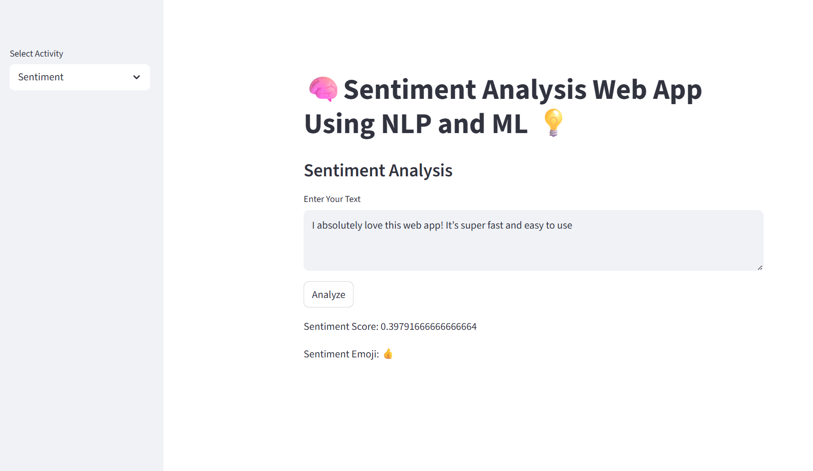
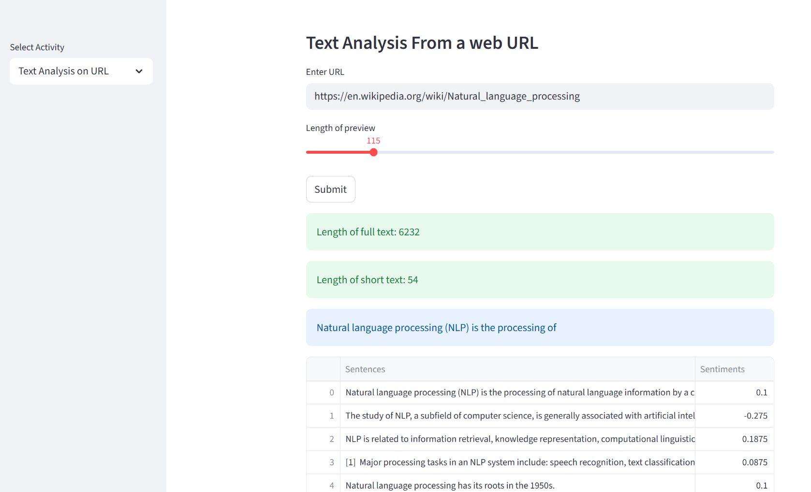
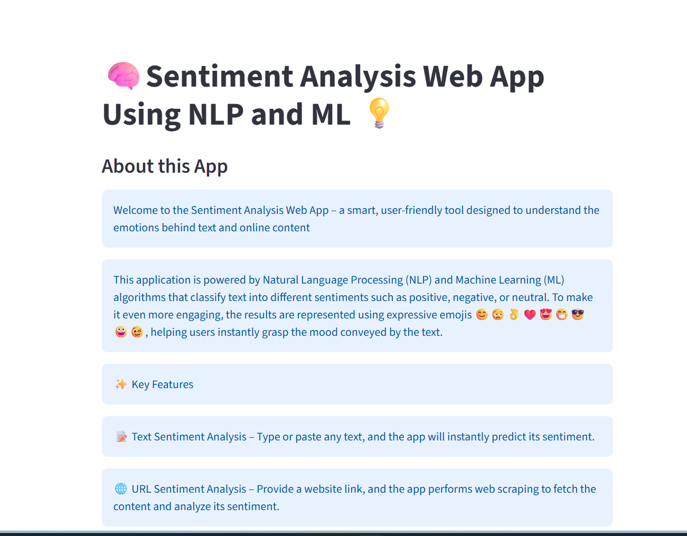

# Sentiment Analysis Web App 😊😒👌❤️😍😁😎😀😉

A web application built with **Natural Language Processing (NLP)** and **Machine Learning (ML)** that analyzes sentiments of text or content from a URL.  
It also performs **web scraping** to fetch data from websites and returns results with expressive **emojis**.
## Table of Contents
- Features
- Screenshots
- Tech Stack
- Installation & Setup
- Usage
- Project Structure
- Future Improvements
- Contributing
- License
## ✨ Features
- 📝 Analyze sentiment of any text
- 🌐 Extract and analyze content from a URL using web scraping
- 😀 Emoji-based sentiment results
- ⚡ Fast & accurate predictions using ML
- 📊 Perfect for reviews, feedback, blogs, or social media text
## 📸 Screenshots

### 🏠 Home Page


### 📊 Results Page


### ℹ️ About Us Page



### 7. **Usage**  
```markdown
## 🚀 Usage
- Enter any text in the input box → get sentiment instantly
- Paste a URL → web scraping will extract content & analyze sentiment
- Sentiment is displayed with emojis for better readability

